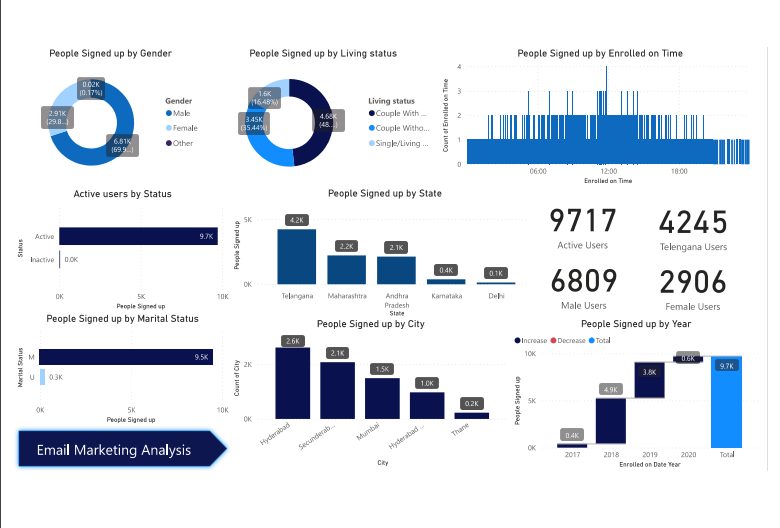

# Email Marketing Analysis Power BI Dashboard

# 🌐 Overview:
- This repository hosts a comprehensive Power BI dashboard designed to analyze and visualize data from an email marketing campaign. It offers insights into audience demographics, signup trends based on age, gender, marital status, living status, city, time, and yearly patterns, enabling effective campaign analysis and strategy formulation.

# 📊 Key Features:

- **People Signed Up by Age:** Visual breakdown showcasing the distribution of signups across different age groups.
- **Gender-Based Signup Analysis:** Insights into the signup distribution based on gender demographics.
- **Marital and Living Status Analysis:** Visualization of signup patterns concerning marital and living status categories.
- **City-Wise Distribution:** Analysis depicting the geographical distribution of signups across different cities or regions.
- **Time-Based Analysis:** Trends illustrating signup frequencies during specific times or intervals.
- **Yearly Signup Patterns:** Visualization showcasing signup trends over different years, aiding in understanding yearly campaign performance.

# 🔍 Data Sources:
-The dashboard utilizes anonymized data obtained from the email marketing campaign's database, ensuring privacy compliance while providing actionable insights.
[Dataset](Email_Marketing_Analysis.xlsx)

# 🚀 How to Use:

- Clone or download the repository.
- Open the Power BI file using Power BI Desktop.
- Access various tabs to explore and interact with different aspects of the email marketing data.
- Utilize filters and slicers to drill down into specific demographics or time frames for in-depth analysis.
